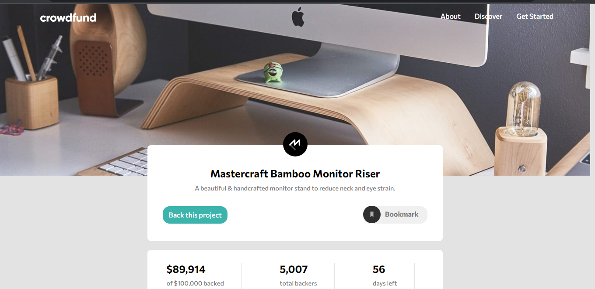
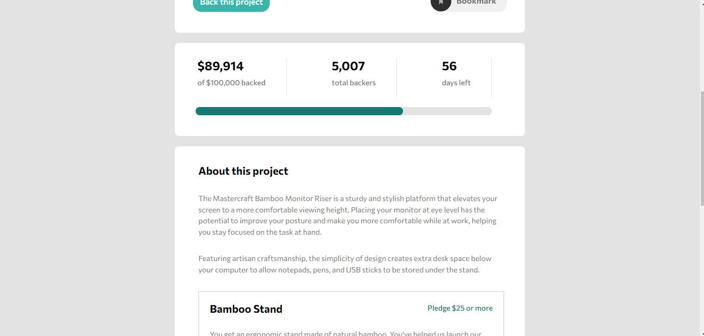
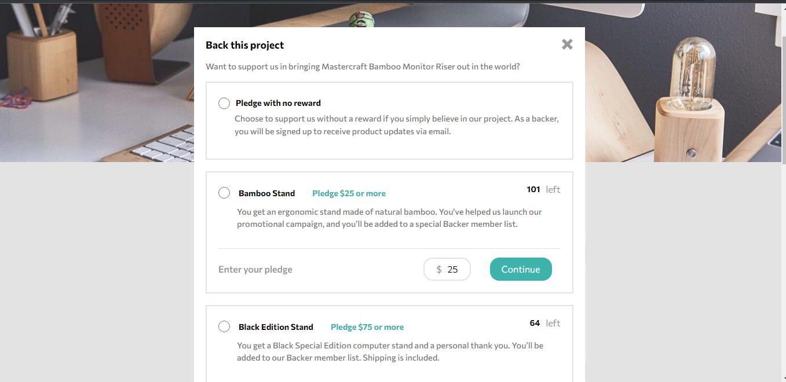
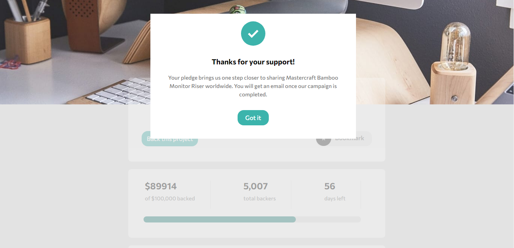
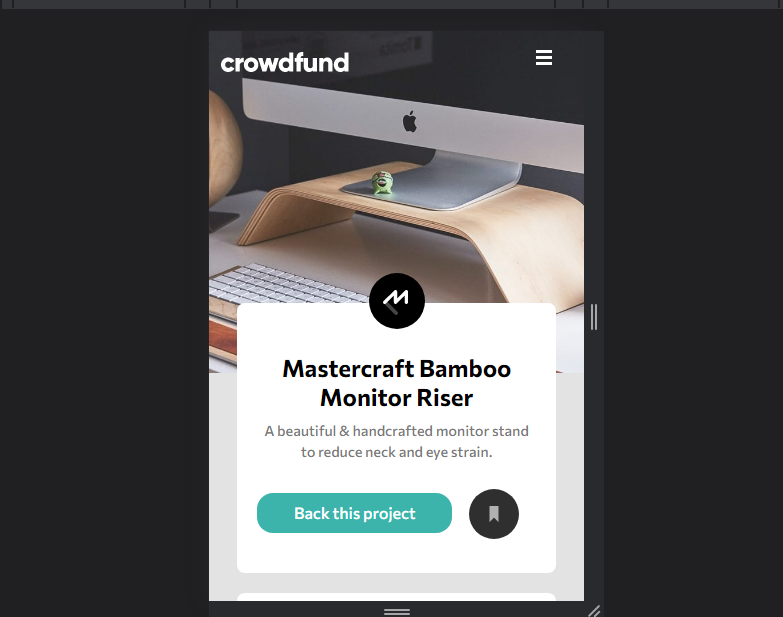
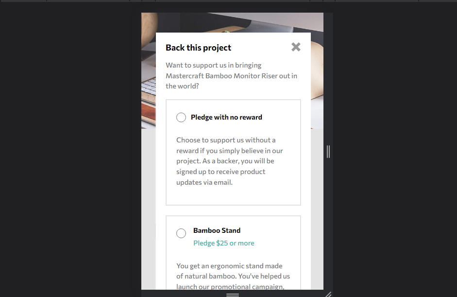
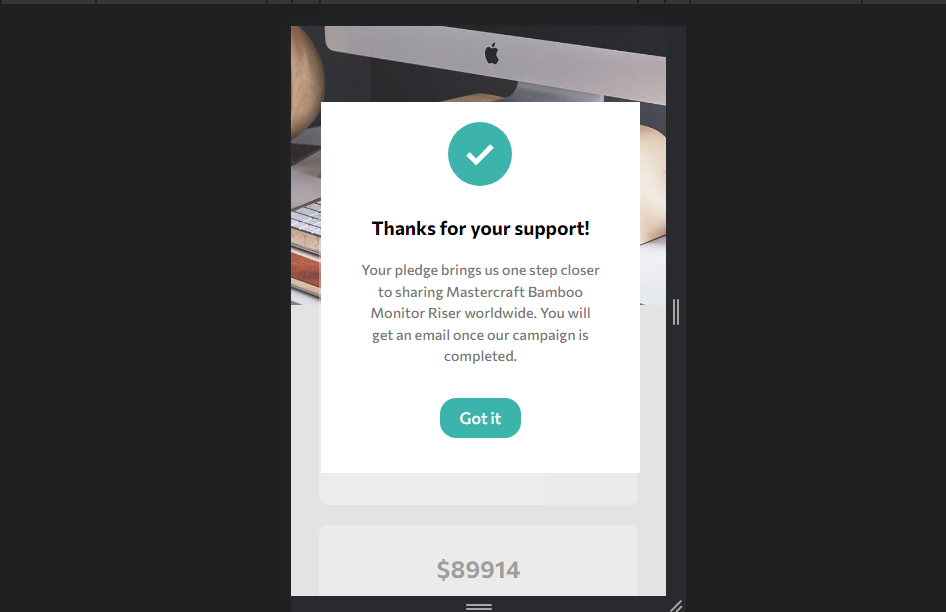

# Frontend Mentor - Crowdfunding product page solution

This is a solution to the [Crowdfunding product page challenge on Frontend Mentor](https://www.frontendmentor.io/challenges/crowdfunding-product-page-7uvcZe7ZR). Frontend Mentor challenges help you improve your coding skills by building realistic projects. 

## Table of contents

- [Overview](#overview)
  - [The challenge](#the-challenge)
  - [Screenshot](#screenshot)
  - [Links](#links)
  - [Built with](#built-with)
- [Author](#author)

## Overview

FEM Crowfunding product page challenge

### The challenge

Users should be able to:

- View the optimal layout depending on their device's screen size
- See hover states for interactive elements
- Make a selection of which pledge to make by clicking "back this project" button
- Cancel the selection pledge modal
- Get a success modal pop up after making a pledge
- Cancelling the success modal pop up by clicking "got it" button
- On screens greater than 900px, clicking the bookmark button changes the innerText to "Bookmarked"

### Screenshot

### Links

- Solution URL: [Git repo url](https://github.com/Plut0r/Crowfunding-product-page)
- Live Site URL: [Git live url](https://your-live-site-url.com)

### Built with

- Semantic HTML5 markup
- CSS custom properties
- Flexbox
- Javascript

## Author

- Frontend Mentor - [@Plut0r](https://www.frontendmentor.io/profile/Plut0r)
- Linkedin - [@Plutor](https://www.linkedin.com/in/plut0r)

